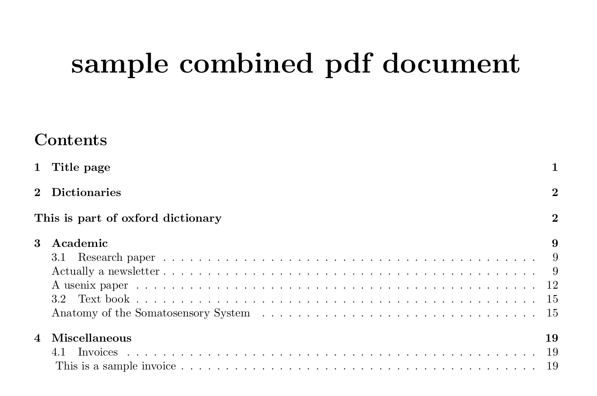

## PDF Aggregator

I am often stuck with several PDFs without lack of a convenient tool to organize them. What I needed was a tool that could create bookmarks and auto-generate a table of contents. This is what the PDF aggregator does. 

You have the capability to organize your PDFs in sections, subsections, and subsubsections. Optionally, you can add a note to a given PDF. This note appears in the generated table of contents.

### Dependencies

- Ubuntu or a similar Unix-based OS
- pdflatex with the following packages installed: {pdfpages, geometry,hyperref,pdflscape}
- python3 with the following packages installed: {argparase, sys, os, csv}

### Usage

One of the first two arguments is mandatory. The last two arguments are optional:

- "-f" a CSV file with each row specifying <pdffile\>,<section\>,<subsection\>,<subsubsection\>,<#nnote_text\>. All elements except section and pdffile are optional. The note element, starting with #n can be placed in any column.
- "-l" space-separated list of arguments. Each argument is a list with a format similar to a single row of the CSV file. i.e. <pdffile\>,<section\>,<subsection\>,<subsubsection\>,<#nnote_text\>. Care must be taken not to introduce spaces. In case of necessary spaces, the words must be enclosed in inverted commas.
- "-t" the title, which will be added in the generated PDF document. Defaults to an empty string
- "-n" is the name of the generated PDF document. Defaults to combined_doc.pdf

### Minimal Example

As a minimal example, run the following command from the root repository folder:

python3 pdf_aggregate.py -f sample.csv -n sample.pdf -t "sample combined pdf document"

This reads sample.csv, which includes the following data. Note that the header row **must not be added** to the csv file. 

| source | level1/note | level2/note | level3/note | note | 
| --- | --- | --- | --- | --- |
| sources1/dictionary.pdf | Dictionaries | #nThis is part of the Oxford dictionary |	
sources1/drylab.pdf | Academic | Research paper | #nActually a newsletter |
sources1/example.pdf | Academic | Research paper | #nA usenix paper |
sources1/invoicesample.pdf | Miscellaneous	Invoices | #n This is a sample invoice |
sources1/somatosensory.pdf | Academic | Text book | #nAnatomy of the Somatosensory System

Therefore, the 4 PDFs from the sources1 folder are added in the appropriate sections and subsections. 

Alternatively, following command line generates an identical file without the need of a csv file:

python3 pdf_aggregate.py -l sources1/dictionary.pdf,Dictionaries,"#nThis is part of oxford dictionary" sources1/drylab.pdf,Academic,"Research paper","#nActually a newsletter" sources1/example.pdf,Academic,"Research paper","#nA usenix paper" sources1/invoicesample.pdf,Miscellaneous,Invoices,"#n This is a sample invoice", sources1/somatosensory.pdf,Academic,"Text book","#nAnatomy of the Somatosensory System" -n sample.pdf -t "sample combined pdf document"

The result is the generation of sample.pdf in the root folder with appropriate sections, subsections, and notes. 

